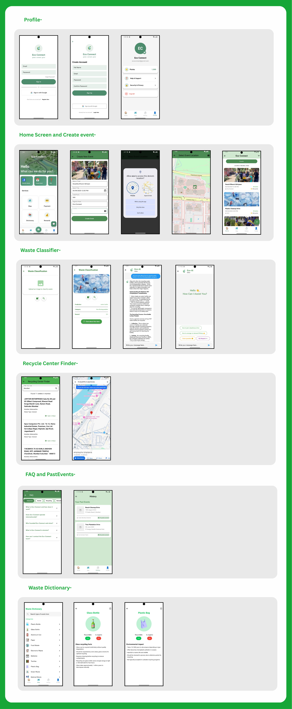
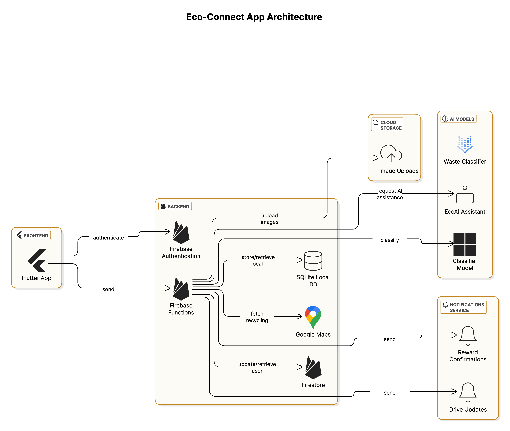

# 🌍 Eco-Connect
[](https://opensource.org/licenses/MIT)
[](https://flutter.dev)
[](https://firebase.google.com)
[](https://ai.google/)
###  GDSC Hackathon Submission

## 📌 Overview  
Developed as my first Flutter project for the **Google Developer Student Clubs (GDSC) Hackathon**, Eco-Connect is a smart waste management platform that bridges the gap between citizens, waste collectors, and recycling facilities using AI and gamification. This project represents my journey into mobile development and sustainable tech solutions.

## 📌 Overview  
Eco-Connect is a smart waste management platform that bridges the gap between citizens, waste collectors, and recycling facilities using AI and gamification. It provides an innovative, scalable, and user-friendly solution to tackle plastic waste and promote sustainability.  

## 🚀 Features  
- **AI-Powered Waste Classification**: Identifies and classifies waste items for efficient disposal.  
- **Reward System**: Encourages sustainable behavior through gamification.  
- **Eco-AI Chatbot**: Powered by Gemini AI to provide guidance on waste segregation.  
- **Real-Time Tracking**: Monitors waste collection and processing for transparency.  
- **Community Engagement**: In-app chat for event discussions and eco-collaboration.  
- **Recycling Center Finder**: Helps users locate the nearest recycling facilities.  
- **Secure Pickup & Payment**: Allows scheduling of waste pickups and secure payments.  
- **Eco Rewards Shop**: Users can redeem points for discounts, eco-products, or donations.  

## 🏗️ Tech Stack  
- **Frontend**: Flutter  
- **Backend**: Firebase  
- **AI/ML**: Gemini AI-powered Eco-AI bot & Waste Classifier Model  
- **Maps & Tracking**: Google Maps API  

## 📜 Problem Statement  
**Transforming Plastic Waste into Sustainable Urban Infrastructure**  
India generates over **62 million tons** of waste annually, with a large portion ending up in landfills. Eco-Connect tackles this issue by leveraging AI-driven waste categorization, real-time tracking, and gamification to optimize recycling and waste management.  

## 🎯 Solution Approach  
- **Seamless Scheduling**: Simplified waste pickup requests.  
- **AI-Driven Awareness**: Interactive chatbot for sustainability education.  
- **Optimized Collection**: Data-driven route planning for waste collectors.  

## 🔥 What Makes Us Unique?  
✅ **Frictionless UX** - Simple scheduling, real-time tracking, and automation.  
✅ **EcoAI Assistant** - 24/7 personalized sustainability guidance.  
✅ **Scalable & Adaptive** - Cloud-based architecture enables rapid expansion.  

## 📱 App Flow


## 🏗️ Architecture


## 📸 MVP Snapshots  
- Waste Classifier  
- Home Page  
- Gemini-Powered Eco-AI  
- Drive Creation Page  
- Recycling Center Finder 

## 📥 Installation  
1. Clone the repository:  
   ```bash
   git clone https://github.com/your-repo-link.git
   ```
2. Navigate to the project directory:  
   ```bash
   cd eco-connect
   ```
3. Install dependencies:  
   ```bash
   flutter pub get
   ```
4. Run the application:  
   ```bash
   flutter run
   ```  

## 🤝 Contributing  
We welcome contributions! Feel free to submit pull requests or raise issues.  

## 📜 License
This project is licensed under the **MIT License** - see the [LICENSE] file for full details. 

## 🔗 Links  
- **Demo Video**: [https://www.youtube.com/watch?v=ilOCAAnTcSE]  
---
